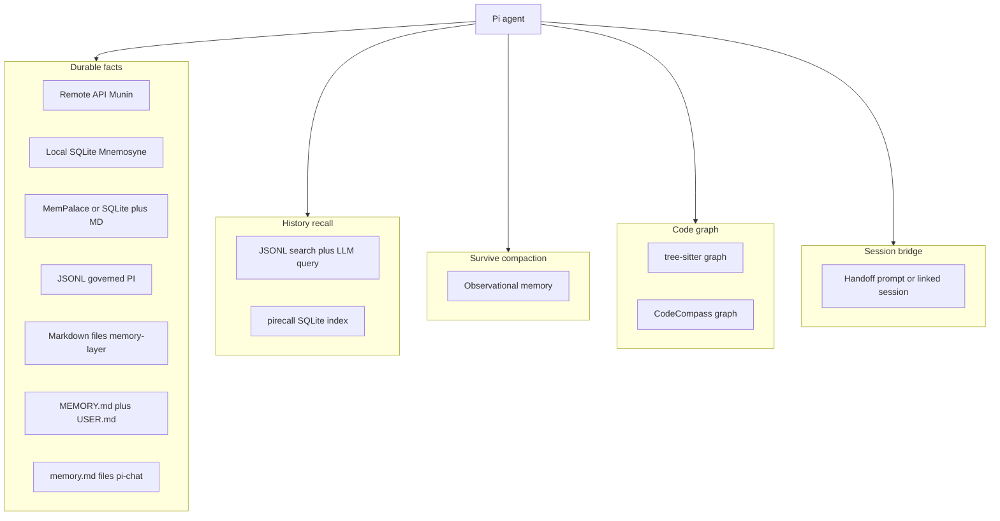

# LLM memory map: `inspirations/` + `insp2/`

Survey date: 2026-08-02  
Scope: projects under `pi-extensions/inspirations/` and `pi-extensions/insp2/` that relate to **agent/LLM memory** (facts, preferences, history, handoff, code knowledge graphs used as memory).  
Out of scope: false positives (RAM, browser daemon persistence, OAuth cache, “muscle memory”).

Duplicates: the same package often appears in monorepo copies (`blabla`, `pi-extensions-5`, `my-pi`). Prefer the `insp2/` copy when present.

---

## A. Durable long-term memory (store / search / forget facts)

| Project | Path | How it solves it |
|---------|------|------------------|
| **pi-mnemosyne** | `insp2/pi-mnemosyne` | Wrapper around Mnemosyne CLI: local SQLite; native remember/recall/forget tools |
| **pi-persistent-intelligence** | `insp2/pi-persistent-intelligence` | Governed project memory: JSONL as canonical store; curation/doctor/health; session search; optional Obsidian |
| **UniPi memory** | `inspirations/UniPi/packages/memory` | MemPalace (vector) + markdown copy; SQLite fallback; project + global scope; injects memory titles at session start; auto-extract on compact |
| **pi-munin** | `inspirations/pi-extensions/pi-munin` | Remote Munin API (`munin.kalera.ai`); store/search/list/share; always-on Memory Protocol in system prompt |
| **memory-layer** | `inspirations/pi-extension/packages/memory-layer` | Markdown under `~/.pi/memory/` (user + project); tools + `/memory` browser UI; index injection |
| **Hermes memory** | `inspirations/pi-agent-dashboard/packages/hermes-memory-plugin` + `docs/plans/hermes-memory-integration.md` | Hermes-inspired: curated MEMORY.md/USER.md + FTS5 session search + skill nudges; dashboard settings for `pi-hermes-memory` |
| **pi-chat memory.md** | `insp2/pi-chat` | Simple files: `/shared/memory.md` + `/workspace/memory.md` injected every turn (Discord/Telegram VM) |

**Pattern A:** explicit write/read tools + (often) prompt injection at start. Differ by backend: local SQLite vs remote API vs markdown vs MemPalace vs governed JSONL.

---

## B. Session recall (search past transcripts, not a fact store)

| Project | Path | How it solves it |
|---------|------|------------------|
| **pi-session-recall** | `insp2/pi-session-recall` (+ `blabla` / `pi-extensions-5`) | On-demand: `session_search` over JSONL → `session_query` (LLM reads selected session). No vector DB |
| **pi-recall** | `insp2/pi-recall` (+ `my-pi`) | Syncs `pirecall` SQLite on start/shutdown; nudges agent to query history; `/resume-recall` picker |

**B vs A:** B finds *what was said*; A stores *what should be remembered*.

---

## C. Observational / compaction memory (survives compact; not necessarily forever)

| Project | Path | How it solves it |
|---------|------|------------------|
| **pi-observational-memory** | `insp2/pi-observational-memory` | Observe → distill reflections → bounded reinjection after compaction (`/om:status`, `/om:view`) |

Nearby but **not** core durable memory (context budget only): `pi-smart-compact`, `pi-context-prune`, `pi-distill`, `pi-condense`, `pi-codex-compaction`.

---

## D. Codebase knowledge graph (“code memory”)

| Project | Path | How it solves it |
|---------|------|------------------|
| **pi-mindplace** | `insp2/pi-mindplace` (+ inspirations copy) | tree-sitter → graph; TF-IDF/BFS query; system-prompt “graph first” |
| **CodeCompass** | `insp2/CodeCompass` | Local JSON graph + agent write-back (descriptions/edges); semantic search; `.codecompass/memory.md` |

**D vs A:** remembers *code structure*, not user preferences.

---

## E. Session handoff (continuity into a new session)

| Project | Path | Status / how |
|---------|------|--------------|
| **pi-handoff** | `insp2/pi-handoff` (+ `blabla` / `pi-extensions-5`) | **Discontinued**; recommends upstream `handoff.ts` |
| **pi-handoff-clipboard** | `insp2/pi-handoff-clipboard` | Builds handoff prompt → clipboard |
| **pi-goal** (handoff) | `insp2/pi-goal` (+ `blabla`) | At ~95% context: `goal_handoff` → linked new session |
| **pi-agent-extensions/handoff** | `inspirations/pi-agent-extensions/extensions/handoff` | Handoff extension + evals |
| **noice-pi cutover** | `inspirations/noice-pi/packages/cutover` | Plan → implementation handoff |

---

## F. Working-memory UI / scratch (weaker “LLM memory”)

| Project | Path | Role |
|---------|------|------|
| **pi-recap** | `insp2/pi-recap` | Live UI: goal + last turns (LLM summarizer) — not a cross-session store |
| **pi-tldr** | `insp2/pi-tldr` | Live status TLDR during a turn |
| **pi-stash** | `insp2/pi-stash` | Per-session prompt scratchpad (human-driven) |

---

## G. Supporting: prompts, distill, KB

| Project | Path | Role |
|---------|------|------|
| **pi-package-prompts-agent-memory** | `inspirations/pi-coding-agent-forge/pi-package-prompts-agent-memory` | Prompt templates: update/summarize/search/prune/session-save memory |
| **pi-extension-memory-helper** | `inspirations/pi-coding-agent-forge/pi-package-skill-lifecycle/vendor/pi-extension-memory-helper` | `remember_note` + per-skill memory tools |
| **distill-session-knowledge** | `inspirations/pi-agent-dashboard/packages/distill-session-knowledge` | Offline-mine JSONL → skills/memory/docs |
| **kb / kb-plugin** | `inspirations/pi-agent-dashboard/packages/kb` | SQLite/FTS5 over markdown (knowledge base, not session memory) |

---

## How the approaches differ

| Approach | Typical projects | Strength | Weakness |
|----------|------------------|----------|----------|
| Markdown + inject | memory-layer, Hermes, pi-chat | Readable, git-friendly | Weak semantic search |
| Local vector/SQLite | Mnemosyne, UniPi, pirecall | Offline, searchable | Quality drifts without curation |
| Remote memory SaaS | Munin | Shared across machines | Network + trust |
| Governed JSONL | persistent-intelligence | Review/doctor/quality | Heavier model |
| Transcript search | session-recall | No extra write protocol | Slow/expensive; not “facts” |
| Compaction side-channel | observational-memory | Survives compact | Short/medium horizon |
| Code graph | mindplace, CodeCompass | Token savings on code | Not user preferences |
| Handoff | handoff*, goal | Fresh session without full history | One-shot, not a store |

---

## Suggested reading order (for nmem / axi comparison)

1. **A core:** UniPi memory, pi-persistent-intelligence, pi-mnemosyne, memory-layer, pi-munin  
2. **B:** pi-session-recall vs pi-recall  
3. **C:** pi-observational-memory  
4. Hermes plan in agent-dashboard (layers documented clearly)  
5. **D** only if “code memory” is in scope  
