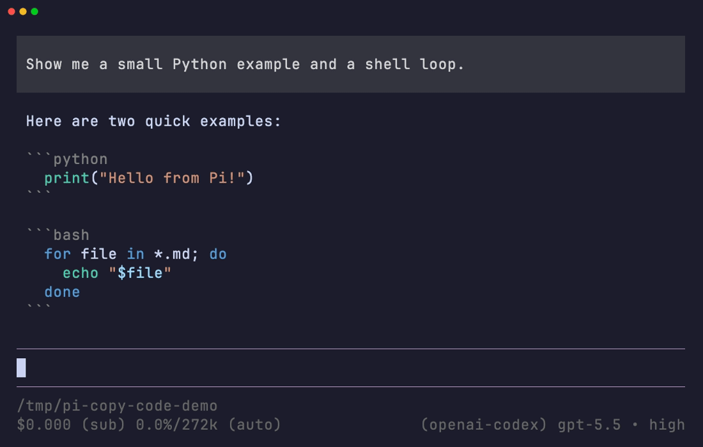

# pi-copy-code

Copy fenced code blocks from [Pi](https://github.com/earendil-works/pi) responses without mouse selection.

A dependency-free Pi extension for copying exactly the code you need from the latest assistant reply.

<p align="center">
  
</p>

## Install

```bash
pi install git:github.com/Vangalle/pi-copy-code
```

If Pi is already open, run `/reload` after installation.

## Usage

```text
/copy-code
```

- One code block is copied immediately.
- Multiple code blocks open a selector.
- Add a one-based block number to copy it without opening the selector:

```text
/copy-code 2
```

Only the latest assistant message is inspected. The extension never falls back to an older reply when the latest one contains no fenced code.

## Supported code fences

- Backtick and tilde fences
- Fence lengths of three or greater
- Up to three leading spaces
- An unclosed final fence from an interrupted response

Copied output excludes the fence, info string or language label, and structural boundary line breaks while preserving the code content itself.

## Scope and compatibility

- Verified with Pi 0.82.1
- Requires Node.js 22.19 or newer
- Makes no network requests
- Has no runtime dependencies

## Local development

Load the checkout directly:

```bash
pi -e /absolute/path/to/pi-copy-code/src/index.ts
```

Install development dependencies and run all checks:

```bash
npm install --ignore-scripts
npm run check
```

Automated tests require no network access, model credentials, or real clipboard.

## License

[MIT](LICENSE)
