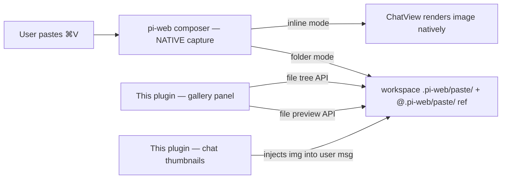

# @yieldcraft/screenshot-paste

> Browse and preview screenshots saved by [pi-web](https://github.com/jmfederico/pi-web) into `.pi-web/paste/` — a gallery panel, a lightbox, and chat-inline previews for folder-mode attachments.

Published by [YieldCraft](https://yieldcraft.io).

---

## What it does (v0.4.0+)

**pi-web now captures pasted screenshots (⌘V) natively** — it resizes the image, manages the attachment UI in the composer, and either sends it inline (multimodal) or saves it into the active workspace at **`.pi-web/paste/`** (folder mode) and inserts `@.pi-web/paste/…` into the prompt.

This plugin **does not duplicate any of that**. It only adds what pi-web does **not** provide natively:

1. **A navigable gallery** of the images in `.pi-web/paste/` (a workspace panel).
2. **A fullscreen lightbox** viewer.
3. **Inline `` previews** inside chat **user** messages for folder-mode refs `@.pi-web/paste/…` (pi-web renders inline-mode images natively but leaves folder-mode `@file` references as plain text).
4. **A "clean" action** that deletes the contents of `.pi-web/paste/`.
5. **Idempotent gitignore** of `.pi-web/paste/` (pi-web does not manage gitignore).

It uses pi-web's **stable plugin file API** (`context.files.readFile/writeFile/deleteFile`), which is federated (works local + remote).

## Prerequisites

- [pi-web](https://github.com/jmfederico/pi-web) — the web UI for pi, **with the stable plugin APIs** (`context.files`, `context.workspace`, `context.machine`).
- [pi](https://github.com/earendil-works/pi-coding-agent) — the AI coding agent.

## Architecture



This package is a **pi-web plugin only**:

- `pi-web-plugin.js` reads `.pi-web/paste/` via pi-web's file tree API, renders thumbnails via the file preview API, injects chat previews, and deletes files via the stable `files` API.
- No local HTTP server. No fixed port. No absolute local paths.
- The only private-API surface is the best-effort chat-thumbnail DOM walk (piercing the `chat-view` shadow root), clearly marked in the code.

## Install

```bash
pi install npm:@yieldcraft/screenshot-paste
```

Restart pi / pi-web, then hard-refresh the browser tab. When upgrading from an older build, do a full browser reload once so any old in-memory plugin runtime is removed.

## Usage

| Action | Result |
|---|---|
| **⌘V** in chat prompt | pi-web captures + saves to `.pi-web/paste/` (folder mode) or sends inline |
| **⌘⇧V** | Open the Paste gallery panel |
| **Panel → Paste tab** | Gallery of image files in the active workspace `.pi-web/paste/` |
| **Panel → Clean .pi-web/paste/** | Delete files inside the active workspace `.pi-web/paste/` folder |
| **Click gallery thumbnail** | Fullscreen lightbox with ← → keyboard nav |
| Folder-mode send | Plugin injects inline `` previews into your chat messages |

## Features

- **Stable pi-web APIs** — `files.deleteFile` (clean), `files.readFile`/`files.writeFile` (gitignore); tree + preview routes for the gallery
- **Workspace-scoped** — reads `.pi-web/paste/` inside the active workspace (local or remote)
- **Auto gitignore** — `.pi-web/paste/` appended to `.gitignore` (granular; never `.pi-web/`, which would untrack `.pi-web/tasks.json`)
- **Workspace gallery** — Paste panel lists image files from `.pi-web/paste/`
- **Responsive thumbnails** — 128×128 letterboxed gallery previews
- **Lightbox** — fullscreen preview with keyboard navigation
- **Chat previews (folder mode)** — inline `` previews inside user messages
- **Workspace clean action** — panel button deletes files inside `.pi-web/paste/`

## Gallery behavior

The Paste panel is workspace-backed:

1. It asks pi-web for the selected workspace's `.pi-web/paste/` directory with the file tree API.
2. It filters image files (`.png`, `.jpg`, `.jpeg`, `.gif`, `.webp`).
3. It renders thumbnails through pi-web's file preview API for the selected machine/workspace.

A short-TTL cache avoids hammering the tree API on every panel render.

## Chat previews (folder mode)

pi-web renders **inline**-mode images natively in the chat. In **folder** mode, the saved file is referenced as `@.pi-web/paste/file.ext` in the prompt text, and pi-web leaves that reference as plain text. This plugin walks the chat DOM and injects an inline `` preview into each **user** message that contains `@.pi-web/paste/...`.

This is a best-effort, private-API feature (no plugin API exposes the chat). It is a no-op in inline mode.

## Agent usage

Files live on disk in `.pi-web/paste/`. When a user asks about a screenshot, the agent can read the referenced relative file path:

```txt
read(".pi-web/paste/paste-....png")
```

## Troubleshooting

| Symptom | Check |
|---|---|
| Paste panel is empty but images exist | Verify the active machine/workspace is the one where `.pi-web/paste/` exists; hard-refresh pi-web. |
| Thumbnails do not load | Check pi-web's file preview API and that paths are relative, e.g. `.pi-web/paste/file.png`. |
| Chat previews missing (folder mode) | Ensure a workspace is selected (open the Paste panel once) and the user message contains `@.pi-web/paste/`. |
| I pasted but nothing saved | pi-web owns paste now — ensure the composer had focus and a workspace is selected. This plugin does not intercept paste. |
| Old staged strip / pending chips reappear | Pre-0.4 plugin still in memory — full-reload pi-web. |
| `.gitignore` not updated | The plugin adds `.pi-web/paste/` lazily on first panel render; ensure `context.files` is available (recent pi-web). |

## Development

```bash
npm run dev:link     # symlink plugin into ~/.pi-web/plugins/
npm run dev:unlink   # remove symlink
```

> ⚠️ **pi-web version requirement** — This plugin depends on pi-web's stable plugin APIs (`context.files`, `context.workspace`, `context.machine`). It only works against a pi-web build that includes those APIs. Against an older pi-web release, the gallery/clean/gitignore features will be unavailable.

See [`docs/tmp/pi-web-api-analysis.md`](docs/tmp/pi-web-api-analysis.md) for the analysis that drove the v0.4 refactor.

## License

MIT © YieldCraft